# Semantic BIM/IFC Evidence-Trace Public Research Artifact

[![Public sample20 v2 validation][sample20-badge]][sample20-workflow]

This repository is the public Semantic BIM/IFC Evidence-Trace Public Research
Artifact for stored-record semantic BIM/IFC validation, strict schema
validation, three-copy integrity verification, and preliminary QLoRA
compute-feasibility evidence. It is not a certification tool, a production BIM
service, or an institutional endorsement. It contains only public synthetic or
sanitized examples.

The workflow checks that the public sanitized `sample20` fixture validates the
strict public `sample20` v2 contract (JSON Schema Draft 2020-12), the
forbidden-pattern scan, and the Hugging Face Space self-tests. It is not a
certification, a production-readiness claim, or a final benchmark.

## Summary

- **Problem**: Natural-language AECO/BIM requests require domain-constrained
  structured outputs. Free-form model outputs can contain invalid IFC classes,
  Psets or relationships when no explicit contract and validation protocol is
  applied.
- **Scientific contribution**: The public artefact defines and validates a
  structured contract over committed semantic BIM/IFC records. The future
  prompt-to-record generation and comparative model benchmark remain planned
  and are not executed here.
- **Public scope**: A minimal sanitized `sample20` reproducibility fixture, the
  strict v2 schema, deterministic stored-record validation, three-copy
  integrity verification, and preliminary QLoRA compute-feasibility evidence.
- **Status**: Preliminary research artifact. The comparative multi-model
  benchmark is planned, not executed.

## Product Boundary

- This repository is a general public scientific research artifact. It is not
  the application package, technical resource request or administrative
  documentation of any specific funding or computing call.
- It is not a peer-reviewed publication.
- It is not a final benchmark.
- It is not an operational product.

See [research positioning and originality boundary](docs/methodology/research_positioning_and_originality.md).

## Research Positioning

- Retrieval, compliance, agents, multi-agent BIM, ontology-aided querying,
  spatial queries and Text2BIM already have prior art.
- The current public contribution is narrower: structured contract + expected
  negatives + deterministic stored-record validation + integrity + bounded
  evidence terminology.
- The comparative benchmark remains planned and not executed.

See [literature capability matrix](benchmark/literature_capability_matrix.md),
[curated positioning bibliography](docs/literature/semantic_bim_ifc_bibliography_ieee.md),
and [baseline matrix](benchmark/baseline_matrix.md).

The literature capability matrix and curated positioning bibliography are
public positioning resources. They are not results of a systematic or scoping review.

## Research Contributions

- **Structured BIM/IFC semantic contract**: a fixed field schema connecting
  natural-language requests to IFC-aware record fields.
- **Strict `sample20` v2 schema**: JSON Schema Draft 2020-12 contract with
  required fields, enumerations and forbidden states.
- **Expected-negative handling**: records whose correct outcome is a canonical
  rejection are recorded and validated as such.
- **Evidence-trace structure**: every record carries structured evidence
  labels and ambiguity context. The current public artefact validates field
  presence and structure; it does not independently verify external-source
  supportedness.
- **Deterministic stored-record validation**: the public harness reloads the
  stored JSONL records and checks schema and fixture conformance. It does not
  rerun model generation or the original prompt-to-output pipeline.
- **Integrity verification**: three-copy schema/JSONL integrity and a
  forbidden scan.
- **Preliminary QLoRA compute calibration**: bounded GPU-hour / VRAM
  calibration from a private, controlled, synthetic pilot (private pilot with
  public aggregate evidence only; not a comparative benchmark result).
- **Planned comparative benchmark**: an eight-family baseline matrix covering
  deterministic lookup, prompt-only LLMs, retrieved IFC/bSDD/IDS context,
  graph or ontology grounding, adaptive tool use, single-agent planning,
  multi-agent workflows and optional QLoRA adaptation after prerequisite
  gates, to be executed, not yet reported.

## Planned Benchmark Methodology

- [benchmark/benchmark_execution_protocol.md](benchmark/benchmark_execution_protocol.md)
- [benchmark/statistical_analysis_plan.md](benchmark/statistical_analysis_plan.md)
- [docs/methodology/dataset_governance_split_and_leakage_protocol.md](docs/methodology/dataset_governance_split_and_leakage_protocol.md)
- [benchmark/baseline_matrix.md](benchmark/baseline_matrix.md)

These documents define planned methodology. They do not report comparative
benchmark results, and they do not convert sample20 into a benchmark.

Measured pilot compute values and independently calculated resource-capacity
estimates are distinct from unexecuted comparative performance claims.

## Why not just IfcOpenShell + LLM + RAG?

IfcOpenShell, LLMs, and retrieval-augmented generation are useful components,
but they do not by themselves define an evaluable BIM semantic compilation
task.

| Component | What it provides | What remains unresolved |
| --- | --- | --- |
| IfcOpenShell | IFC parsing, querying and manipulation | It does not interpret ambiguous professional BIM requests by itself. |
| LLM | Language understanding and generation | It may hallucinate IFC classes, Psets or relationships without contract-level validation. |
| RAG | Retrieval of relevant context fragments | Retrieval alone does not guarantee structured output, schema conformance or field-level evaluation. |
| This protocol | Structured IFC-aware semantic records, validation, evidence and stored-record checks | It keeps the public boundary on committed records and planned evaluation. |

The current public contribution is narrower than a complete BIM-LLM system. It
defines and validates a stored-record semantic contract and its public
evidence boundary. The larger governed dataset and comparative evaluation
remain planned.

## What "semantic" means here

In this repository, "semantic" means that a BIM request is decomposed into
explicit, inspectable fields, including:

- intent class;
- semantic type;
- IFC class;
- value mode;
- normalized dimensions;
- required Psets;
- required IFC relationships;
- missing inputs;
- ambiguity flags;
- recovery-needed state;
- recovery type;
- safe next action;
- reason codes;
- evidence trace.

The semantic layer is therefore a structured contract between natural language
and IFC-aware computation.

## What "XAI" means here

XAI is treated as evidence-oriented explainability, not as a claim of full
mathematical interpretability.

The repository focuses on whether a semantic BIM output can expose:

- IFC class stored in the record;
- required Psets and relationships;
- missing and ambiguous fields;
- evidence label, observed-relation label and ambiguity context;
- JSON parsing, schema, fixture-contract and integrity states.

The public artefact validates evidence-trace structure and internal coherence.
It does not resolve an external evidence source, verify that a source supports
a claim, or establish causal model attribution.

Clarifications:

- This is closer to provenance, auditability and structured validation than to
  SHAP/LIME-style feature attribution.
- No SHAP/LIME attribution method is implemented in the public artefact.
- No chain-of-thought is published as part of the public sample.
- No complete mathematical attribution is claimed.

## Architecture

```mermaid
flowchart LR
    A[Natural-language AECO request] --> B[Semantic decomposition]
    B --> C[IFC class / Pset / relationship mapping]
    C --> D[Structured contract]
    D --> E[JSON Schema validation]
    E --> F[Canonical checks]
    F --> G[Expected-negative handling]
    G --> H[Evidence trace]
    H --> I[Stored-record validation]
    I --> J[Benchmark metrics]
    J --> K[Professional review or safe next action]
```



The left side of this diagram represents the research target. The executable
public boundary begins with committed structured records. No public component
currently converts a new natural-language request into a model-generated
record.

## Components and responsibilities

| Component | Responsibility | Current public status |
| --- | --- | --- |
| Semantic compiler | Decompose a natural-language request into structured intent, semantic type, missing inputs and ambiguity flags. | CONCEPTUAL / PLANNED |
| IFC mapper | Map the request to candidate IFC classes, required Psets and required relationships. | CONCEPTUAL / PLANNED |
| Schema validator | Enforce the strict `sample20` v2 JSON Schema Draft 2020-12 contract. | EXECUTABLE - schema-only |
| Canonical / fixture checker | Verify agreement between model output, reference output and case expectation over committed records. | EXECUTABLE - committed records |
| Evidence-trace fields | Store evidence labels, observed-relationship labels and ambiguity context. | STRUCTURAL DATA FIELDS |
| Stored-record validator | Load the committed fixture and validate schema, case expectation and stored conformance. | EXECUTABLE - no model generation |
| Integrity verifier | Verify byte identity of the three public JSONL/schema copies and consistency of published fixture metrics. | EXECUTABLE |
| QLoRA aggregate verifier | Checks aggregate structure, bounded values, distribution totals and derived compute arithmetic. It does not reproduce the private experiment and does not independently recompute empirical held-out scores. It does not prove superiority. It does not prove generalization. | EXECUTABLE OVER PUBLISHED AGGREGATES |
| Benchmark layer | Compute public sample metrics and host the planned comparative benchmark matrix. | PARTIAL - sample metrics available; comparative benchmark planned |
| Interactive Spaces | Replay Space displays and validates stored records; Harness is a constrained conceptual demonstration; neither publishes live private-model inference. | EXECUTABLE / CONCEPTUAL HYBRID |

## Start Here

| Need | Path |
| --- | --- |
| public sample | `sample20/` |
| stored-record validation | `QUICKSTART.md` |
| validation evidence | `PUBLIC_EVIDENCE.md` |
| benchmark sample results | `benchmark/results_sample20.md` |
| preliminary QLoRA evidence | `benchmark/qlora/` |
| public/private boundary | `docs/public_boundary.md` |
| end-to-end example | `docs/examples/end_to_end_public_example.md` |
| planned comparative benchmark matrix | `benchmark/baseline_matrix.md` |

## Public project channels

| Channel | URL | Purpose |
| --- | --- | --- |
| GitHub | https://github.com/xaibim/semantic-bim-ifc-xai | Canonical source, CI and public evidence |
| Hugging Face | https://huggingface.co/XAIBIM/spaces | Public interactive Spaces |
| Replay Space | https://huggingface.co/spaces/XAIBIM/semantic-xaibim-replay | Stored `sample20` v2 viewer/validator |
| Harness Space | https://huggingface.co/spaces/XAIBIM/semantic-xaibim-harness | Interactive conceptual demonstration |
| Kaggle | https://www.kaggle.com/code/xaibim/semantic-bim-ifc-xai | Preliminary QLoRA computational feasibility notebook |
| YouTube | https://www.youtube.com/@XAIBIM | Public demonstrations and dissemination |
| LinkedIn | https://www.linkedin.com/company/xaibim | Project updates and professional dissemination |

YouTube and LinkedIn are dissemination channels. They are not presented as
scientific evidence, peer review, or institutional endorsement.

`Replay` remains in the historical CLI and Space names. In the current public
artefact it means loading and validating committed records, not rerunning a
model or the original prompt-to-output pipeline.

The `XAIBIM` Space URLs are the canonical public gateways. Remote equivalence is claimed only after commit, file-hash and post-deployment self-test evidence is recorded in docs/evidence/public_deployment_manifest.json. The canonical public entry points remain the `XAIBIM` URLs.

## Quickstart

See [QUICKSTART.md](QUICKSTART.md) for the minimal local stored-record
validation steps. The schema command must reference the strict v2 contract
explicitly:

```powershell
python harness/schema_validator.py sample20/sample20_public_records.jsonl --schema sample20/schema_public_sample20_v2.json
```

## Public results

`sample20` contains 20 public records: 18 valid cases and 2 expected canonical
rejections.

Current public validation status: `PUBLIC_SAMPLE_VALID_WITH_EXPECTED_NEGATIVES`.

- `canonical_acceptance_rate = 0.9` (18/20): 18 records have
  `canonical_check.ok = true`; this is an acceptance share, not accuracy or
  validation success.
- `expectation_met_rate = 1.0` (20/20): each record's actual status matches
  its case expectation.
- `value_mode` distribution: `GUIDED_RECOVERY = 9`, `PREVIEW = 6`,
  `PROPOSAL = 5`.
- All `1.0` agreement metrics indicate internal consistency with the stored
  synthetic reference, not general model performance or generalization.

`sample20` is a minimal reproducibility sample. It is not a complete corpus and
is not a final benchmark.

## Current limitations

- Minimal public sample (`sample20`, 20 records).
- Synthetic/sanitized records; no real IFC files.
- No final multi-model benchmark yet.
- No broad AECO generalization established.
- No SHAP/LIME mathematical attribution.
- No certification or automated engineering approval.
- No private adapters or checkpoints are public.
- No public claim of multilingual coverage.
- No public claim of building-typology coverage.

## Roadmap

**Completed**

- `sample20` v2 strict contract;
- strict JSON Schema Draft 2020-12;
- expected-negative handling;
- integrity verifier (three-copy and forbidden scan);
- GitHub CI;
- preliminary QLoRA feasibility pilot;
- public Replay Space;
- public Harness Space;
- GitHub `xaibim` namespace;
- Hugging Face `XAIBIM` namespace.

**Planned comparative benchmark**

- scope freeze;
- dataset expansion;
- baseline matrix execution;
- repeated seeds;
- multi-model evaluation;
- optional bounded QLoRA adaptation after dataset-quality and baseline gates;
- error taxonomy;
- domain expert review;
- aggregate public release.

## Links and citation

- Canonical repository: <https://github.com/xaibim/semantic-bim-ifc-xai>
- Methodology: [validation_gates.md](docs/methodology/validation_gates.md),
  [dataset_construction_and_benchmark_readiness.md](docs/methodology/dataset_construction_and_benchmark_readiness.md),
  [dataset_scope_and_compute_scaling.md](docs/methodology/dataset_scope_and_compute_scaling.md)
- End-to-end example: [docs/examples/end_to_end_public_example.md](docs/examples/end_to_end_public_example.md)
- Baseline matrix (planned): [benchmark/baseline_matrix.md](benchmark/baseline_matrix.md)
- License separation: [LICENSES.md](LICENSES.md)
- Citation: see [CITATION.cff](CITATION.cff)

## What is not claimed

This repository does not claim full mathematical XAI, certification, production
readiness, or institutional endorsement. It does not include private datasets,
adapters, checkpoints, or secrets.

[sample20-badge]: https://github.com/xaibim/semantic-bim-ifc-xai/actions/workflows/public-sample20.yml/badge.svg
[sample20-workflow]: https://github.com/xaibim/semantic-bim-ifc-xai/actions/workflows/public-sample20.yml
