# Semantic BIM/IFC Evidence-Grounded Research Artifact

[![Public sample20 v2 validation][sample20-badge]][sample20-workflow]

This repository is a public academic research artifact for stored-record
semantic BIM/IFC sample validation, strict schema validation, three-copy
integrity verification, and preliminary QLoRA compute-feasibility evidence. It
is **not** a certification tool, a production BIM service, or an institutional
endorsement. It contains only public synthetic or sanitized examples.

The workflow checks that the public sanitized `sample20` fixture validates the
**strict public `sample20` v2 contract (JSON Schema Draft 2020-12)**, the
forbidden-pattern scan, and the Hugging Face Space self-tests. It is not a
certification, a production-readiness claim, or a final benchmark.

## Summary

- **Problem**: Natural-language AECO/BIM requests are ambiguous and
  domain-constrained. Free-form LLM or RAG outputs for BIM/IFC reasoning tend to
  hallucinate IFC classes, property sets, and relationships without a
  contract-level, replayable, evidence-grounded evaluation.
- **Scientific contribution**: A structured, schema-validated semantic contract
  that turns ambiguous BIM/IFC requests into inspectable, replayable,
  evidence-traceable records suitable for benchmarking.
- **Public scope**: A minimal sanitized `sample20` reproducibility fixture, the
  strict v2 schema, deterministic stored-record validation, three-copy
  integrity verification, and preliminary QLoRA compute-feasibility evidence.
- **Status**: Preliminary research artifact. The comparative multi-model
  benchmark is planned, not executed.

## Research Contributions

- **Structured BIM/IFC semantic contract**: a fixed field schema connecting
  natural-language requests to IFC class / Pset / relationship mappings.
- **Strict `sample20` v2 schema**: JSON Schema Draft 2020-12 contract with
  required fields, enumerations, and forbidden states.
- **Expected-negative handling**: records whose correct outcome is a canonical
  rejection are recorded and validated as such.
- **Evidence-trace structure**: every record carries structured evidence labels
  and ambiguity context. The current public artifact validates field presence
  and structure; it does not independently verify source-grounded supportedness.
- **Deterministic stored-record validation**: the public harness reloads the
  stored JSONL records and checks schema and fixture conformance. It does not
  rerun model generation or the original prompt-to-output pipeline.
- **Integrity verification**: three-copy schema/JSONL integrity and a forbidden
  scan.
- **Preliminary QLoRA compute calibration**: bounded GPU-hour / VRAM calibration
  from a private, controlled, synthetic pilot (not a public result).
- **Planned comparative benchmark**: a baseline matrix (rule/schema lookup,
  prompt-only LLM, retrieved-context LLM, optional graph/ontology retrieval)
  to be executed, not yet reported.

## Why not just IfcOpenShell + LLM + RAG?

IfcOpenShell, LLMs, and retrieval-augmented generation are useful components,
but they do not by themselves define an evaluable BIM semantic compilation task.

| Component | What it provides | What remains unresolved |
| --- | --- | --- |
| IfcOpenShell | IFC parsing, querying and manipulation | It does not interpret ambiguous professional BIM requests by itself. |
| LLM | Language understanding and generation | It may hallucinate IFC classes, Psets or relationships without contract-level validation. |
| RAG | Retrieval of relevant context fragments | Retrieval alone does not guarantee structured output, schema conformance or field-level evaluation. |
| This protocol | Structured IFC-aware semantic records, validation, evidence and replay | It turns the interaction into a measurable benchmark task. |

The contribution is therefore not another combination of existing tools. It is
the definition and evaluation of a structured semantic contract for BIM/IFC
reasoning.

## What "semantic" means here

In this repository, "semantic" does not mean only embeddings or semantic search.
It means that a BIM request is decomposed into explicit, inspectable fields,
including:

- intent class;
- semantic type;
- IFC class and IFC candidates;
- normalized dimensions;
- material information;
- required Psets;
- required IFC relationships;
- missing information;
- ambiguity flags;
- recovery needs;
- reason codes;
- evidence trace.

The semantic layer is therefore a structured contract between natural language
and IFC-aware computation.

## What "XAI" means here

XAI is treated as **evidence-oriented explainability**, not as a claim of full
mathematical interpretability.

The repository focuses on whether a semantic BIM output can expose:

- which IFC class or candidates were selected;
- which Psets and relationships are required;
- which fields are missing or ambiguous;
- which evidence fragments or runtime context supported the output;
- whether the generated record passes schema and replay validation.

Clarifications:

- This is closer to **provenance, evidence traceability and structured
  auditability** than to SHAP/LIME-style feature attribution.
- No SHAP/LIME attribution method is implemented in the public artifact.
- No chain-of-thought is published as part of the public sample.
- No complete mathematical attribution is claimed.

## Architecture

```mermaid
flowchart LR
    A[Natural-language AECO request] --> B[Semantic decomposition]
    B --> C[IFC class / Pset / relationship mapping]
    C --> D[Structured contract]
    D --> E[JSON Schema validation]
    E --> F[Canonical checks]
    F --> G[Expected-negative handling]
    G --> H[Evidence trace]
    H --> I[Stored-record validation]
    I --> J[Benchmark metrics]
    J --> K[Professional review or safe next action]
```



## Components and responsibilities

| Component | Responsibility |
| --- | --- |
| Semantic compiler | Decompose the natural-language request into structured intent, semantic type, missing inputs and ambiguity flags. |
| IFC mapper | Map the request to candidate IFC classes, required Psets and required relationships. |
| Schema validator | Enforce the strict `sample20` v2 JSON Schema Draft 2020-12 contract. |
| Canonical checker | Verify agreement between model output, reference output and case expectation. |
| Evidence trace fields | Store evidence labels, observed-relationship labels and ambiguity context. Public source-grounding verification is not yet implemented. |
| Stored-record validator | Load the committed fixture and validate schema, case expectation and stored conformance. No model generation is rerun. |
| Integrity verifier | Verify byte identity of the three public JSONL/schema copies and consistency of published fixture metrics. |
| QLoRA aggregate verifier | Independently verify the published aggregate feasibility metrics. |
| Benchmark layer | Compute public sample metrics and host the planned comparative benchmark matrix. |
| Interactive Space | Public Hugging Face interface for stored replay and conceptual demonstration. |

## Start Here

| Need | Path |
| --- | --- |
| public sample | `sample20/` |
| stored-record validation | `QUICKSTART.md` |
| validation evidence | `PUBLIC_EVIDENCE.md` |
| benchmark sample results | `benchmark/results_sample20.md` |
| preliminary QLoRA evidence | `benchmark/qlora/` |
| public/private boundary | `docs/public_boundary.md` |
| end-to-end example | `docs/examples/end_to_end_public_example.md` |
| planned comparative benchmark matrix | `benchmark/baseline_matrix.md` |

## Public project channels

| Channel | URL | Purpose |
| --- | --- | --- |
| GitHub | https://github.com/xaibim/semantic-bim-ifc-xai | Canonical source, CI, releases and public evidence |
| Hugging Face | https://huggingface.co/XAIBIM/spaces | Public interactive Spaces |
| Replay Space | https://huggingface.co/spaces/XAIBIM/semantic-xaibim-replay | Stored `sample20` v2 replay |
| Harness Space | https://huggingface.co/spaces/XAIBIM/semantic-xaibim-harness | Interactive conceptual demonstration |
| Kaggle | https://www.kaggle.com/code/xaibim/semantic-bim-ifc-xai | Preliminary QLoRA computational feasibility notebook |
| YouTube | https://www.youtube.com/@XAIBIM | Public demonstrations and dissemination |
| LinkedIn | https://www.linkedin.com/company/xaibim | Project updates and professional dissemination |

YouTube and LinkedIn are dissemination channels. They are **not** presented as
scientific evidence, peer review, or institutional endorsement.

The `XAIBIM` Space URLs are the canonical public gateways. The verified
Gradio runtime implementations are currently hosted under the `bimaiblend`
namespace. The gateway/runtime separation is an infrastructure arrangement;
the canonical public entry points remain the `XAIBIM` URLs.

## Quickstart

See [QUICKSTART.md](QUICKSTART.md) for the minimal local stored-record
validation steps. The
schema command must reference the strict v2 contract explicitly:

```powershell
python harness/schema_validator.py sample20/sample20_public_records.jsonl --schema sample20/schema_public_sample20_v2.json
```

## Public results

`sample20` contains 20 public records: 18 valid cases and 2 expected canonical
rejections.

Current public validation status: `PUBLIC_SAMPLE_VALID_WITH_EXPECTED_NEGATIVES`.

- `canonical_validation_rate = 0.9` (18/20): the two expected negatives are
  rejected as intended.
- `expectation_met_rate = 1.0` (20/20): each record's actual status matches its
  case expectation.
- `value_mode` distribution: `GUIDED_RECOVERY = 9`, `PREVIEW = 6`,
  `PROPOSAL = 5`.
- All `1.0` agreement metrics indicate internal consistency with the stored
  synthetic reference, **not** general model performance or generalization.

`sample20` is a minimal reproducibility sample. It is not a complete corpus and
is not a final benchmark.

## Current limitations

- Minimal public sample (`sample20`, 20 records).
- Synthetic/sanitized records; no real IFC files.
- No final multi-model benchmark yet.
- No broad AECO generalization established.
- No SHAP/LIME mathematical attribution.
- No certification or automated engineering approval.
- No public private adapters/checkpoints.
- No public claim of multilingual coverage.
- No public claim of building-typology coverage.

## Roadmap

**Completed**

- `sample20` v2 strict contract;
- strict JSON Schema Draft 2020-12;
- expected-negative handling;
- integrity verifier (three-copy and forbidden scan);
- GitHub CI;
- preliminary QLoRA feasibility pilot;
- public Replay Space;
- public Harness Space;
- GitHub `xaibim` namespace;
- Hugging Face `XAIBIM` namespace.

**Planned comparative benchmark**

- scope freeze;
- dataset expansion;
- baseline matrix execution;
- repeated seeds;
- multi-model evaluation;
- optional bounded QLoRA adaptation after dataset-quality and baseline gates;
- error taxonomy;
- domain expert review;
- aggregate public release.

## Links and citation

- Canonical repository: <https://github.com/xaibim/semantic-bim-ifc-xai>
- Methodology: [validation_gates.md](docs/methodology/validation_gates.md),
  [dataset_construction_and_training_readiness.md](docs/methodology/dataset_construction_and_training_readiness.md),
  [dataset_scope_and_compute_scaling.md](docs/methodology/dataset_scope_and_compute_scaling.md)
- End-to-end example: [docs/examples/end_to_end_public_example.md](docs/examples/end_to_end_public_example.md)
- Baseline matrix (planned): [benchmark/baseline_matrix.md](benchmark/baseline_matrix.md)
- License separation: [LICENSES.md](LICENSES.md)
- Citation: see [CITATION.cff](CITATION.cff)

## What is not claimed

This repository does not claim full mathematical XAI, certification, production
readiness, or institutional endorsement. It does not include private datasets,
adapters, checkpoints, or secrets.

[sample20-badge]: https://github.com/xaibim/semantic-bim-ifc-xai/actions/workflows/public-sample20.yml/badge.svg
[sample20-workflow]: https://github.com/xaibim/semantic-bim-ifc-xai/actions/workflows/public-sample20.yml
